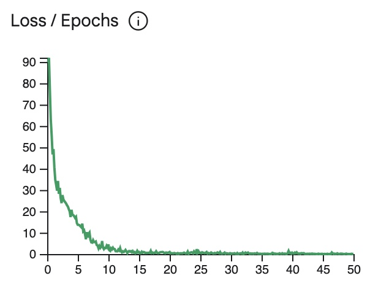

# 🧠 AI Mental Health Assistant

An AI-powered mental health chatbot designed to provide emotional support, resources, and emergency contact options. Built using **Gemini AI** for natural language processing and **Next.js** for the frontend.

## Live Demo

Check out our chatbot in action: [HackAI Chatbot](https://hackai-chatbot.vercel.app/)

---

## ✨ Features

✅ **Conversational AI** – Provides mental health support using NLP (powered by Gemini AI).  
✅ **Personalized User Input** – Users can enter their name and an optional emergency contact.  
✅ **Real-time Chat** – Instant response from the chatbot for emotional sympathy and guidance.  
✅ **Secure Backend API** – Handles user data and interactions safely.

---

## 🚀 Tech Stack

| Tech                 | Description                               |
| -------------------- | ----------------------------------------- |
| 🟢 **Google Gemini** | Tuned AI Model for Mental Health Support. |
| 🔵 **Next.js**       | Frontend framework for UI & API routes.   |
| 🎨 **Shadcn UI**     | Styling for a modern, sleek interface.    |
| ⚡ **TypeScript**    | Ensures robust and scalable code.         |

---

## ⚙️ Under the Hood

### 🔹 Model Training Configuration

- **Base Model:** `Gemini-1.5-Flash-001-(Tuned)`
- **Epochs:** `50`
- **Batch Size:** `32`
- **Learning Rate:** `0.001`

### 🔍 Parameters Explained

**Epochs** – Defines how many times the model processes the entire dataset. More epochs improve learning but can lead to overfitting if set too high.

**Batch Size** – Determines how many training samples are processed at once before updating the model's weights. Smaller batches allow for better generalization, while larger ones speed up training.

**Learning Rate** – Controls how quickly the model updates its weights during training. A balanced learning rate ensures stable and effective learning without overshooting optimal solutions.

### Loss/Epoch Graph

## 
